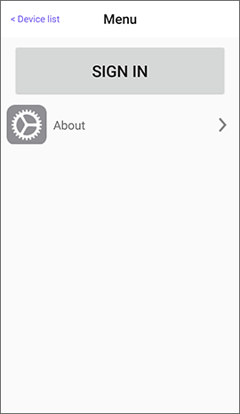
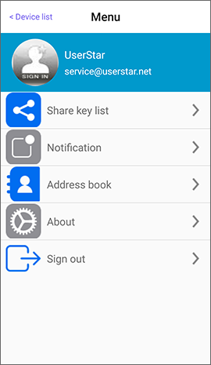

# Workspace overview

## Main Page

Launch the app and enter the main page. The list on the top is Menu, Device list, Add device, Adjust the order.

Device list will show the devices that have been paired. When you swipe left each item of the device, there are three icons as explained below:

1. Wake up and unlock \(support some devices\): The APP needs to be running in the background. It will automatically connect with the device and unlock after the device is been wake up.
2. Auto connection: When the APP is opened, it will automatically connect with the device, enter the unlock page and then the user needs to click the unlock button.
3. According to the key’s authority \(general user/manager\), there are different items to be set.

When there is a paired device near the mobile phone, a blue light will appear on the left side of the device item to indicate that mobile phone can connect with the device now.

 

## Menu

On the main page, click on the Menu in the top left corner and you can sign in there.

After sign in, there are: Personal Information, Share key list, Notification, Address book, About, Sign out.

 

