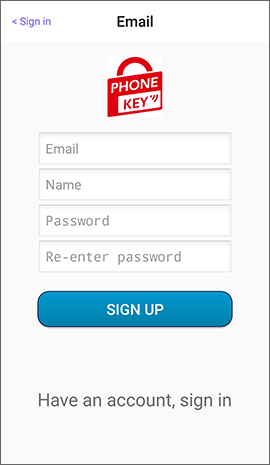
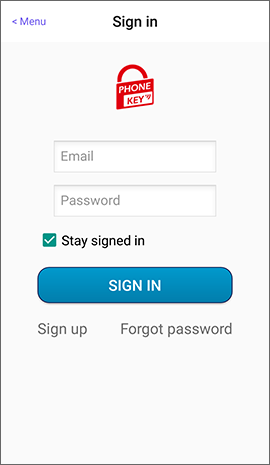

# Sign in your account

## 帳號的用途

PHONEKEY提供離線操作，您可使用**裝置密碼**在每位使用者的手機建立數位鑰匙\(一般使用者/管理者\)，這些鑰匙允許每位使用者離線使用。

註冊並登入帳號提供您便利的雲端功能，例如：

> 擁有管理者鑰匙的人，可以在APP登入**PHONEKEY帳號**、手機連網且與鎖具連線的狀態下，進行管理分享鑰匙。

## 登入您的帳號

### 已有帳號

在首頁點選左上角的選單 -&gt;點選登入 -&gt;輸入帳號密碼

### 創建帳號

在首頁點選左上角的選單 -&gt;點選登入 -&gt;點選註冊，按照步驟輸入資料後，再到註冊信箱點選啟用連結。

 

