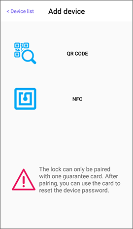
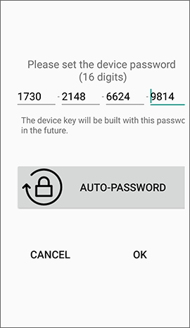
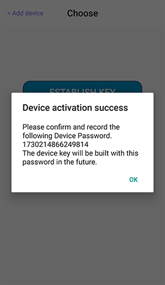

# How to activate the device

PHONEKEY lock device needs to be paired with the RFID guarantee card and set device password during activation process. When the password is forgotten, the NFC mobile phone can read the paired RFID guarantee card to reset the password.

## 1.Pairing lock

At the top right of the app's main page, press "+" to Add device, then mobile phone will scan for locks that are connectable and have no pairing. The first 3 codes of the item on the list are product categories, such as GRG is a garage lock, CAB is a cabinet lock, and so on.

Select the item to pair with the lock. After the connection is successful, the lock will sound a beep 3 times.

 

## 2. Auto detection for activation status

If the lock had not been activated, user has to pair the RFID guarantee card in the first.

### 2.1 Scan QR code

Please align the camera lens with QR code.

### 2.2 Use NFC mobile phone to read the RFID guarantee card

Turn on the NFC function of mobile phone and place the NFC sensing area close to the RFID guarantee card for reading.

## 3. Set device password

The device password of lock allows the **administrator** to create keys and modify the settings of lock.

**The Bluetooth lock and mobile phone does not save the device password. Please be sure to store the password and the RFID guarantee card properly.** Please avoid using easy-to-guess passwords such as 0000-0000-0000-0000 to prevent unauthorized usage of the lock. If you use AUTO-PASSWORD to get random passwords, you can take a screenshot or copy the passwords in your wallet or store them in a cloud storage such as iCloud or Google Drive.

 

