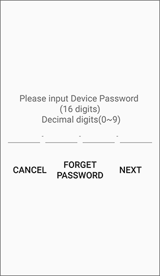
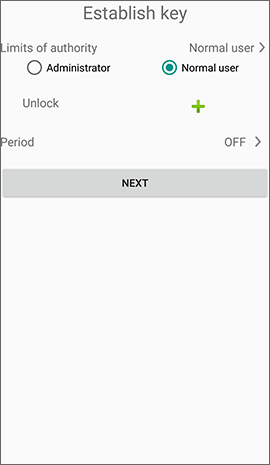
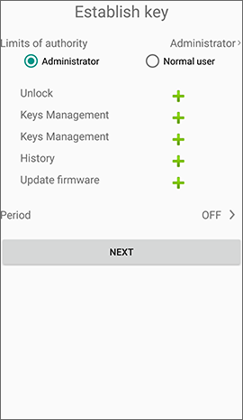
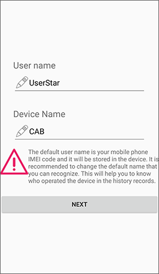

# How to add an Offline Key

For lock has been activated, user can add offline keys with the **Device Password** and up to 100 offline keys can be set.

## 1. Pairing lock 

At the top right of the app's main page, press "+" to Add device, then mobile phone will scan for locks that are connectable and have no pairing. The first 3 codes of the item on the list are device categories. Such as GRG is a garage lock, CAB is a cabinet lock, and so on.

Select the item to pair with the lock. After the connection is successful, the lock will sound a beep 3 times.

 

## 2. Options for the key generation 

Choose **ESTABLISH KEY**.

## 3. Input device password 

If the **Device Password** was entered incorrectly more than three times, this function will be suspended for 15 minutes.

## 4. Forget password 

Forgotten passwords can be reset using the RFID guarantee card.

## 5. Choose key type 

The key type is preset to the **Normal user** and can be adjusted to **Administrator**.

 

## 6. Set user name and device name 

The user name is preset to the IMEI code of the mobile phone and will be stored in the lock. It is recommended to change the user name for you to remember easily. So when you query the unlock history, you can recognize the user. **If the user had signed in this app, the user name will be filled in by the account name.**

The device name is preset to the device category code, and it is recommended to change it to a simple one for easy to remember.

## 7. Complete offline key establishment, return to the Device list 

