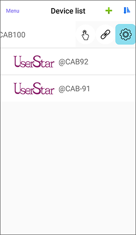
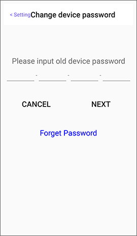
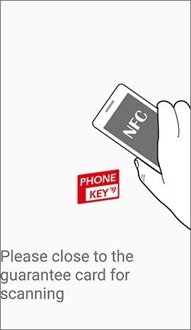
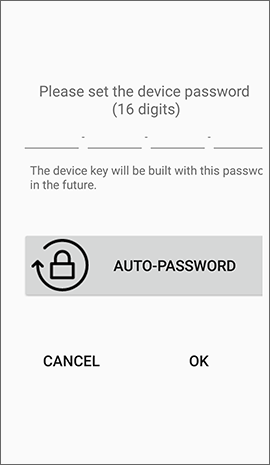

# How to change the device password

## 1. Enter Setting of the lock, click Change device password.

 

## 2. Choose how to change

You can directly input the old device password, or click "Forget Password" to read the original paired RFID guarantee card by NFC mobile phone. **For iPhone or Android phone without NFC, user can only input the old device password.**

 

## 3.  Input new device password

**The Bluetooth lock and mobile phone does not save the device password. Please be sure to store the password and the RFID guarantee card properly.** Please avoid using easy-to-guess passwords such as 0000-0000-0000-0000 to prevent unauthorized usage of the lock. If you use AUTO-PASSWORD to get random passwords, you can take a screenshot or copy the passwords in your wallet or store them in a cloud storage such as iCloud or Google Drive.

