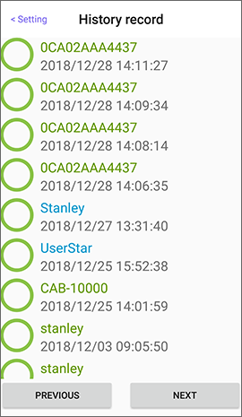

# How to check the history

The user with the **administrator** key can select **History record** in the Setting of lock. The History record of the lock is sorted by time and the history content varies depending on the lock properties, such as the auto-locking lock, which only records the "unlock time"; the Bluetooth garage opener records the time of "up", "stop", and "down".

* Online key history can only be read by the ID that enable the online key.

 

