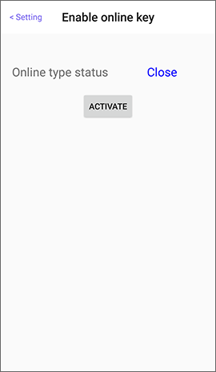

# How to create a Share Key

After the lock was activated and the offline key was established, the **administrator** can enable “offline key” \(up to 10 keys\) or "online key" when signing in the APP and in connected with the internet and the lock.

* If the manager A has enabled a certain offline key, the manager B may disable the key and then re-enable the key, and the share right of key will be assigned to the manager B.
* If the administrator closes a certain offline key, the key will be cleared and cannot be used anymore.
* If the administrator changes the online key status from ACTIVATE to Close, all online keys will be cleared and cannot be used anymore.

## 1. Enter Setting of the lock 

Look for the lock item from the Device list, swipe left and enter Setting of the lock \(gear icon\).

 

## 2. Enable share key

Choose to enable the offline key or online key.

* Each offline key can only be used by one user.
* Click the offline key to modify the device key name.
* Only the enabled offline keys will display in the shared key list.

 

