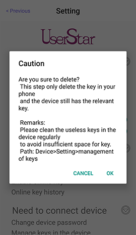

# How to delete the key in mobile phone

Select **Delete key** in the Setting page.

> This operation will only delete the key in the phone and the relevant key remains in the device.  
> Administrator needs to clean the useless keys in the device regularly to avoid the lack of space for new key.

 

