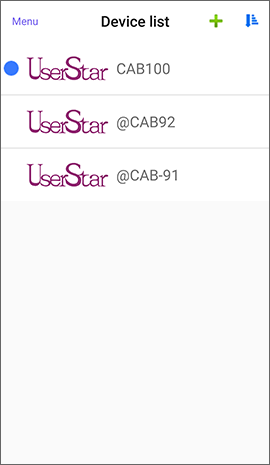
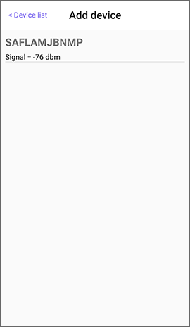
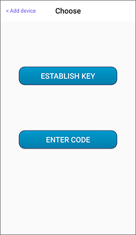

# How to download a Share Key

The recipient's mobile phone needs to connect to the Internet, and signs in the APP or has obtained the verification Code.

* The online key will show on the Device list automatically with the “@” symbol in front of the device name. **If there is an offline key in the app, then the online key will not display.**
* For offline key, please follow the instructions below.

## 1. Pairing lock 

At the top right of the app's main page, press "**+**" to **Add device**, then mobile phone will scan for locks that are connectable and have no pairing. The first 3 codes of the item on the list are device categories. Such as GRG is a garage lock, CAB is a cabinet lock, and so on.

Select the item to pair with the lock. After the connection is successful, the lock will sound a beep 3 times.

 

## 2. Options for the key generation 

Choose **ENTER CODE**.  
If the share key had been assigned an ID and the APP is signed in to the same ID, the key will be automatically established.  
If the share key had been assigned a verification Code, you will need to enter the correct verification Code to establish the key.

