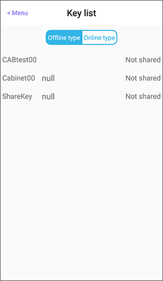
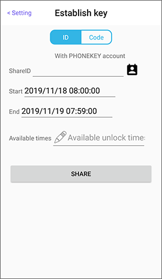
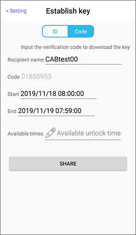
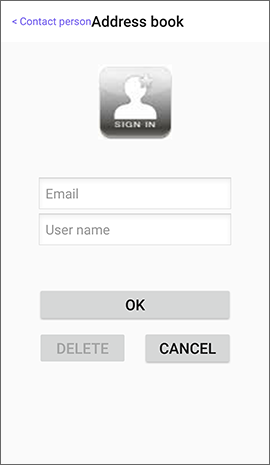
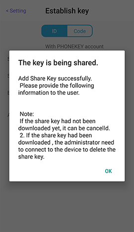
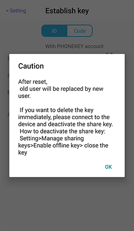
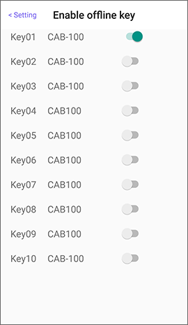

# How to share a Share Key

When the mobile phone is connection with the internet, administrator should sign in with PHONEKEY account to manage the shared key, no need to connect with the lock.

## 1. There are two ways to enter the key list

1.1 When sign in, enter Setting of lock and select **Key list**, there will show the enabled keys of this device.

 

2.2 When sign in, enter menu at the top left of the main page and select the **Share key list**, there will show the enabled keys of all devices in your phone.

## 2. Sharing method

Set key permissions in the **Key list** or **Share key list**:   
**Offline key** can specify ID or Code. However, **online key** can only specify ID.

 

Input the **ID account** or choose the contact icon to select the ID account from address book.

> This ID account must have been registered.   
> You can add the email and name of the ID account first in the menu -&gt; Address book from main page.

You can also choose **Code** and provide this verification Code to the recipient.

### 2.1 Set share key permissions

1. Start date, End date and Available times are "AND" combinations. The key will be invalid when out of Available times during the share period.
2. The verification Code is automatically generated by the server and cannot be changed by the user.

 

## 3.Edit share settings

### 3.1 Not downloaded yet

If the **offline key** has not been used, the status of the key will be **not downloaded yet**. You can modify its settings or cancel sharing.

### 3.2 Downloaded

If the **offline key** is already in use, the status of the key will be **downloaded**. You only can RESET this key.

> After reset, old user will be replaced by new user.  
> If you want to delete the key immediately, please connect the device and deactivate the share key.

 

