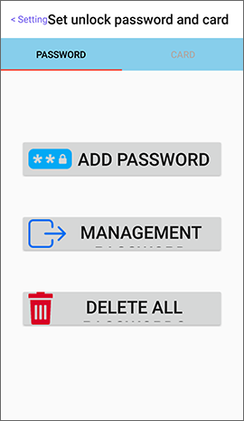
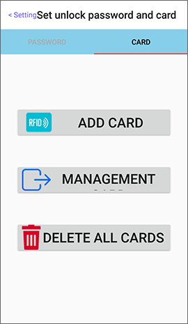

# Bluetooth Door Lock

After the door lock is activated and established an offline key, please click “**Set unlock password and card**” on the Setting page.

This operation requires administrator key authority.

## Password

The password should be 6 digits and up to 10 passwords can be added. You can add passwords, manage passwords, or delete all passwords in this page.

## Card

Please add card with MIFARE card \(ISO14443A/ 13.56 MHz, such as EasyCard\) and up to 30 cards can be added. You can add cards, manage cards, or delete all cards in this page.

 

