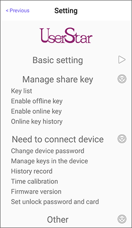

# Bluetooth Garage Opener

## Time calibration

The Bluetooth Garage Opener has no internal battery. When power failure, it will cause a time error. Administrator needs to perform “**Time calibration**”.

 

